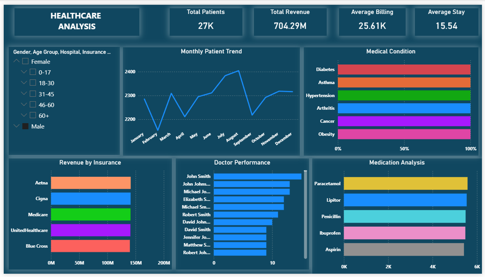

# Healthcare-Analysis-Dashboard
Healthcare Analytics Dashboard using Power BI
# 🏥 Healthcare Analysis Dashboard

## 📊 Overview

This project presents a comprehensive healthcare analytics dashboard built using Power BI.

## 🚀 Key Insights

* Total Patients: 27K
* Total Revenue: 704M+
* Average Billing: 25.6K
* Average Stay: 15.5 days

## 📈 Dashboard Features

* Monthly Patient Trends
* Revenue by Insurance Providers
* Doctor Performance Analysis
* Medical Condition Distribution
* Medication Usage Analysis

## 🛠 Tools Used

* Power BI
* Excel / CSV
* Data Cleaning & Transformation

## 📸 Dashboard Preview

## 📂 Files Included

* `.pbix` file
* Dataset
* Dashboard screenshot

## 🔗 How to Use

1. Download the `.pbix` file
2. Open in Power BI Desktop
3. Refresh data if needed

## 👤 Author

Perarivalan
Data Analyst

## ⭐ If you like this project, give it a star!
